# Road Snow Removal And Black Ice Detection System (도로 제설 및 블랙아이스 검출 시스템)

## Summary

1. 적설현상을 보이면 자동으로 제설장치를 가동하여 제설제를 뿌리도록 설계
2. 제설장치 가동 후 녹은 눈이 얼어붙을 것을 감안하여 결빙현상을 감지

## List of sensors

|No.|Items|Product SN|Purpose of use|
|:-:|:---:|:-----:|:------------|
|1|DHT11|DHT11|도로의 온도와 습도 측정 및 결빙이 되는 지점 파악|
|2|Dot Matrix 8x8|MAX7219|블랙아이스 및 결빙현상이 일어날 경우 경고|
|3|DC Motor|RF-260|팬을 돌려 제설제를 고르게 살포|
|4|Servo Motor|SG90|제설제 살포를 위한 모터|
|5|Ultrasonic Sensor|HC-SR04|속도 측정을 위한 센서|
|6|LCD|SZH-EK101|현재 속도를 표시 및 과속 경고|
|7|LED|LED|속도에 따른 불빛으로 속도 경고|
|8|Buzzer|Piezo Buzzer|속도에 따른 경고음으로 속도 경고|

## Settings

|No.|Image|Explain|
|:-:|:---:|:------|
|1|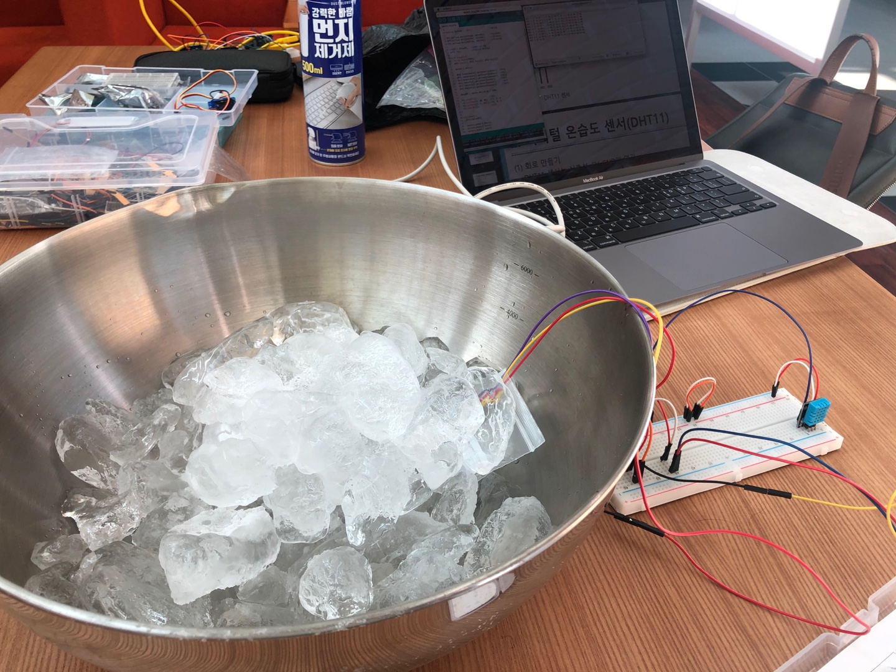|적설, 결빙현상 및 주변 기온 측정|
|2|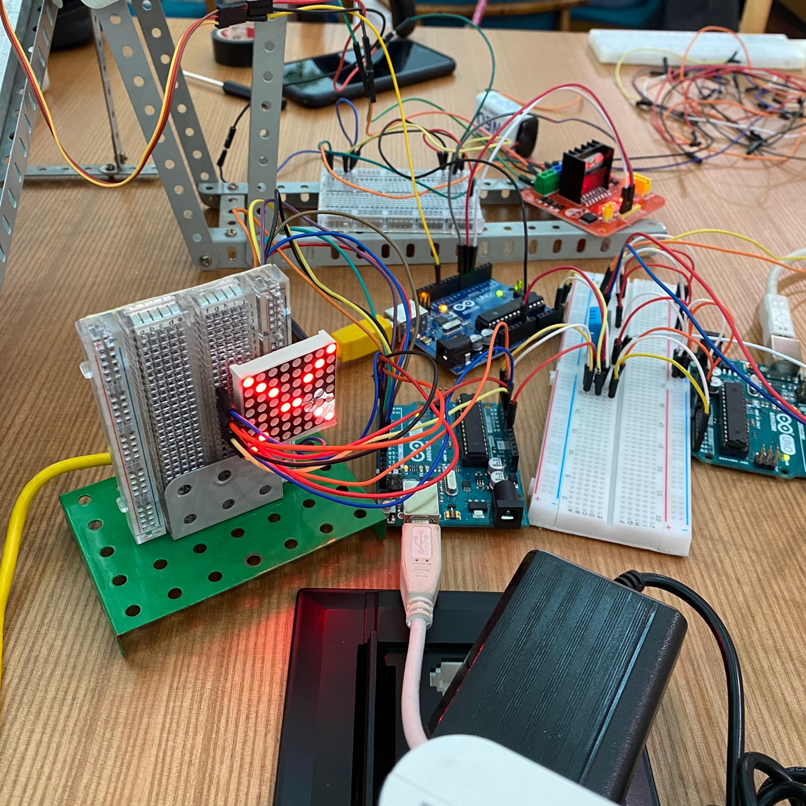|온도 측정 상황에 따라 현재 상태 표현|
|3|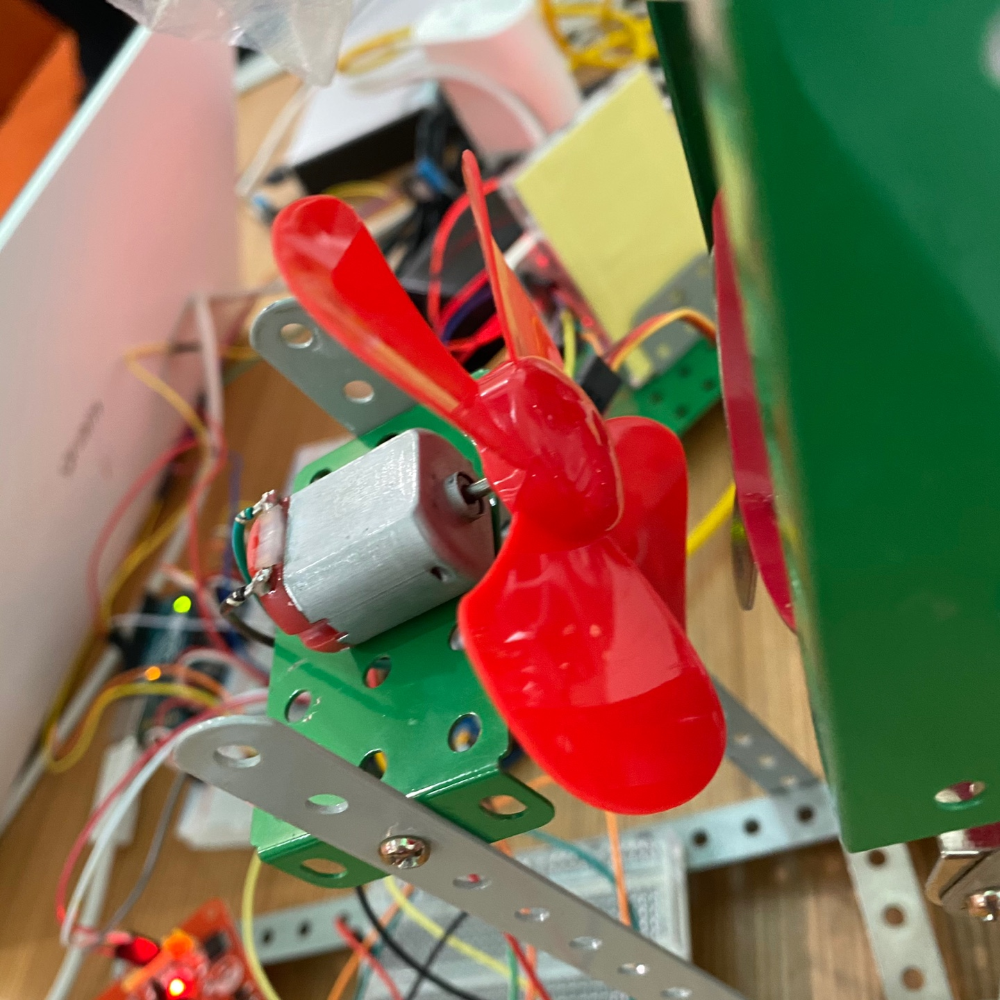|제설제를 넓게 뿌릴 수 있도록 팬을 부착|
|4|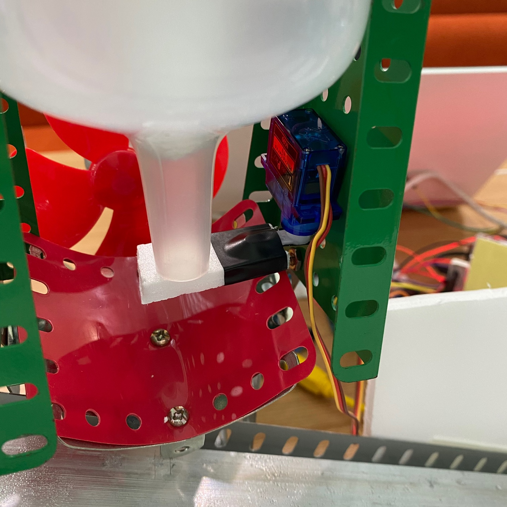|제설제 양 조절|
|5|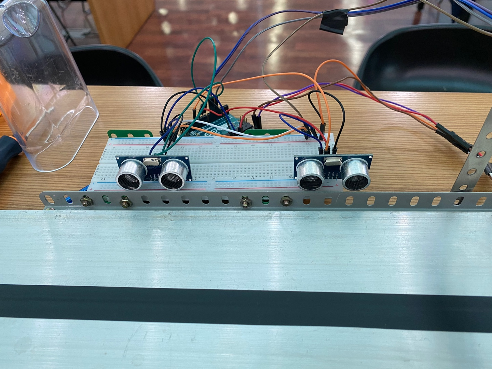|자동차의 속도를 측정|
|6|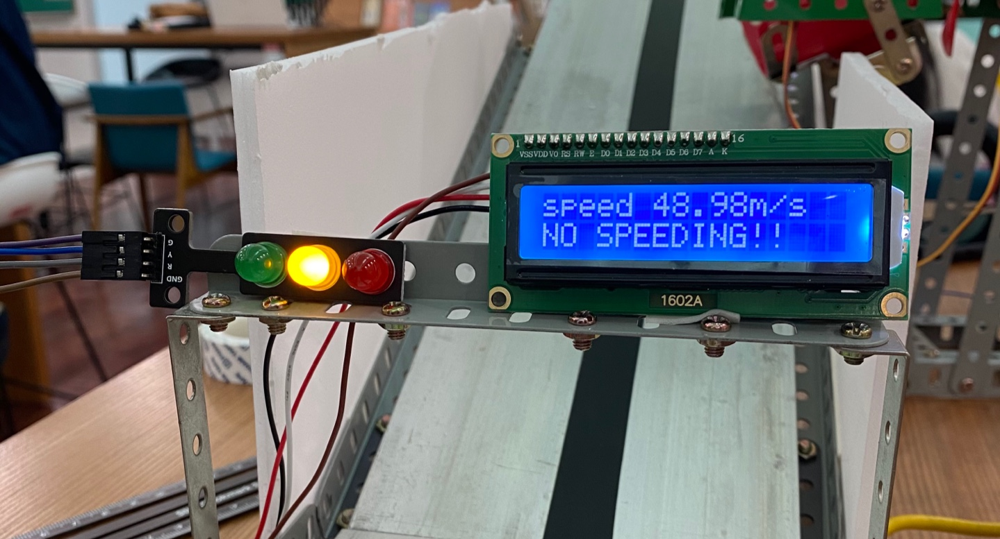|자동차의 속도를 표시|
|7|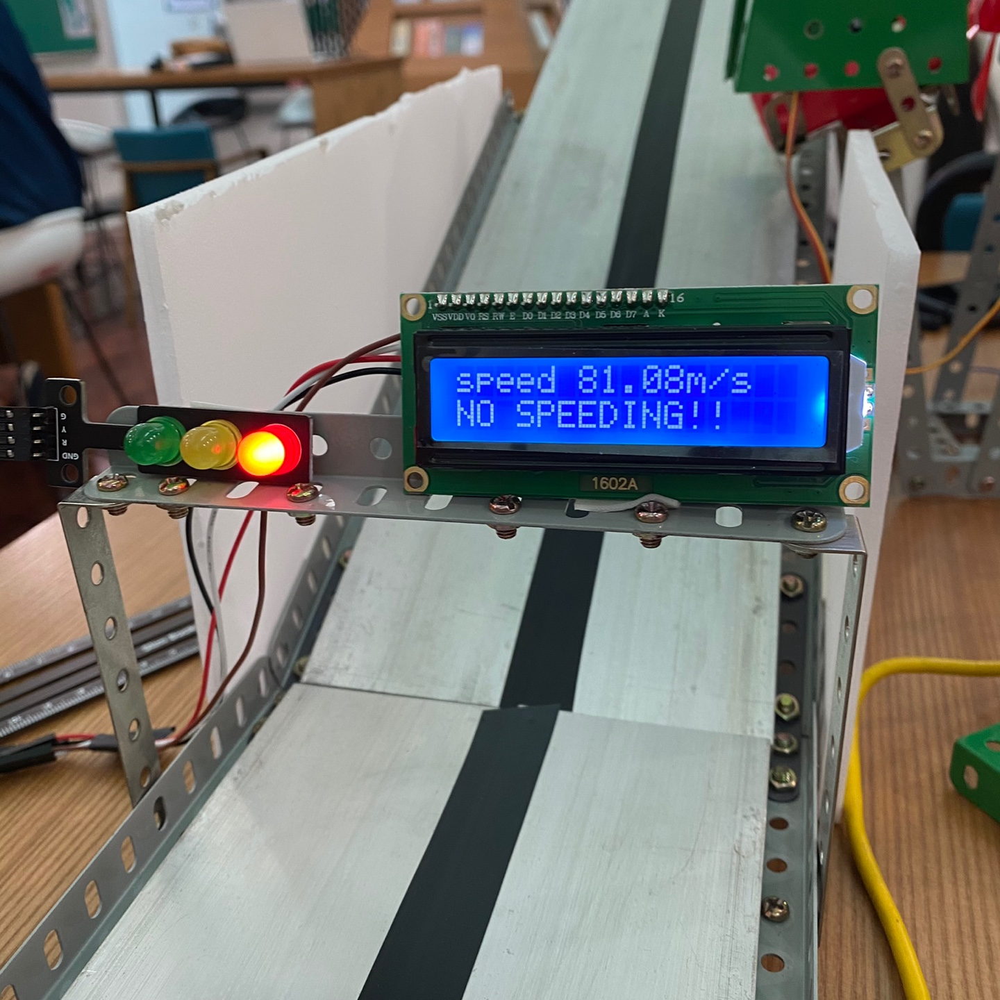|속도에 따라 신호등 색 변경|
|8|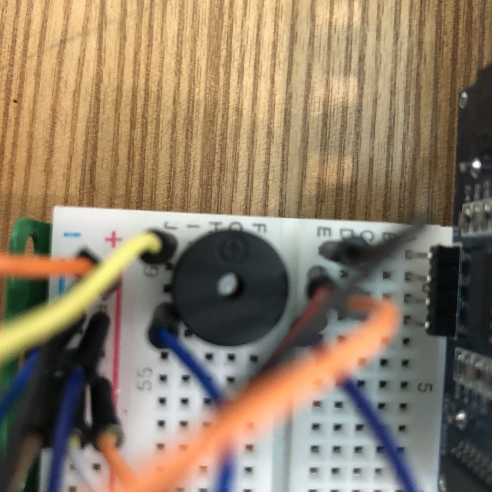|과속시 부저음|

## Activate

|No.|Image|Explain|
|:-:|:---:|:-----:|
|1|*No image*|*보고서 내 표 참고*|
|2| |위: 블랙아이스 경고, 아래: 제설장치 가동|
|3|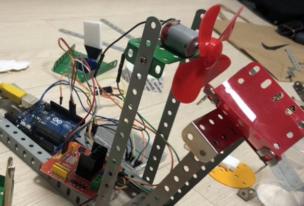|결빙상태시 DC모터 제설제 살포|
|4|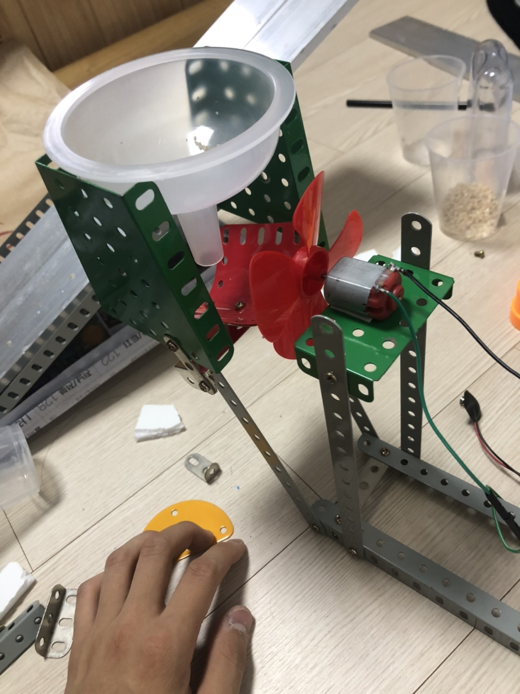|결빙상태시 서보모터 제설제 살포|
|5-6|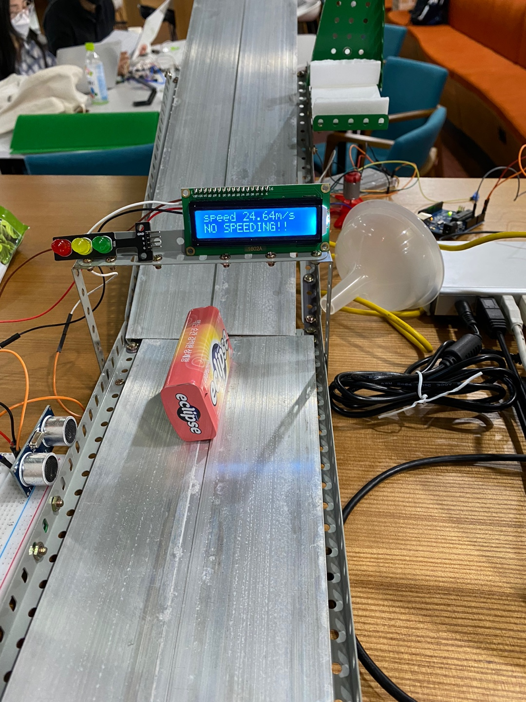|초음파 센서 데이터를 받아 LCD에 출력|
|7||속도 >= 80: 적색, 속도 <= 40: 녹색, 40 < 속도 < 80: 황색|
|8|*No image*|*LED가 적색일 때 경고음*|

## See more info in [here](최종결과보고서(양식)-압축됨.pdf)